# **行为树（Behavior Tree, BT）**

# 1. 是什么

## 1.1 BT 的定义

行为树（Behavior Tree, BT）是一种用树状结构组织智能体行为逻辑的决策模型。
它具有以下核心特点：

* **层次化结构**：使用树节点表达行为逻辑。
* **Tick 驱动执行模型**：根节点周期性被 tick，状态沿树传播，节点返回三种状态：

  * `SUCCESS`
  * `FAILURE`
  * `RUNNING`
* **逻辑与行为解耦**：高层（控制策略）与底层（动作实现）分离，提高可复用性。
* **组件化与可编排性**：通过组合节点可以构建复杂任务流程，易调试、易拓展。

BT 最初用于游戏 AI（如 Halo），后来广泛应用于机器人控制（仓储机器人、叉车、移动机器人等）。

---

## 1.2 BT 与 FSM（有限状态机）对比

| 维度          | BT（行为树）                      | FSM（有限状态机）                      |
| ----------- | ---------------------------- | ------------------------------- |
| **结构复杂度**   | 层级结构天然支持组合、复用，复杂度随树深度线性增长    | 状态和状态间迁移呈指数级膨胀（State Explosion） |
| **逻辑修改成本**  | 可独立修改子树，影响范围可控               | 改一个状态可能影响多个转移，维护成本高             |
| **并行与中断能力** | 支持并行节点、优先级节点、守护节点（Decorator） | 中断通常需显式建状态，结构复杂                 |
| **可读性与可视化** | 可直接图形化表达                     | 状态机复杂后难理解                       |
| **重复行为复用**  | 子树可复用                        | 需重复建状态或使用嵌套子状态（复杂）              |
| **适用场景**    | 有层级结构、流程多变、需容错的场景（机器人）       | 逻辑简单、状态少、确定性强的场景（协议、硬件）         |

### 总结

* **FSM 适合“确定流程、离散事件少”的系统**。
* **BT 适合“复杂流程、混合行为、需要容错”的机器人系统**。
  无人叉车属于后者，因此 BT 更合适。

---

# 2. 干什么

## 2.1 BT 在无人叉车系统中能干什么

无人叉车（AGF / laser AGV）典型特征：

* 多任务调度
* 多阶段作业（移载 / 穿叉 / 升降 / 放置）
* 同时需兼容安全检测、导航、避障、重规划、故障处理
  → **非常复杂、且特别适合 BT 的层级与容错结构**

BT 在无人叉车系统中的典型功能包括：

###  任务级决策

* 接收任务（拉货、放货、调度指令）
* 根据黑板（Blackboard）中的任务参数自动分解流程
* 不同任务类型通过复用子树完成（取货、放货等）

###  动作与子任务组织

* 导航 → 停靠 → 对位 → 升降 → 抓取/放置
* 使用 Sequence、Selector 做条件判断与子流程切换
* 支持失败回退（Fallback）提高鲁棒性

###  安全逻辑

* 随时检测急停信号
* 障碍物检测、避障失败重规划
* 货物状态检查（是否叉稳？是否掉载？）

###  异常恢复

* 导航失败 → 重规划
* 抓取失败 → 再次对位/重新插叉
* 放置失败 → 重试或报警
* 故障 → 集成 fallback 节点进入安全模式

---

## 2.2 无人叉车典型作业场景 & BT 能做什么

###  场景 1：自动取货 → 运送 → 放货（最常见）

流程：

1. 导航到托盘 A
2. 自动对位
3. 穿叉 + 升起
4. 导航到目标点
5. 放下托盘并退出

对应 BT 功能：

* 用一个 Sequence 表达完整作业流程
* 在导航失败时，Selector 自动执行 “ReplanRoute”
* 在取货失败时进入 “重新对位” 子树
* 全程安全条件装饰节点监控

---

###  场景 2：带交通管理的多车协作

BT 可以协调：

* 等信号灯
* 进入区域前先注册资源（Traffic Control）
* 避让其他设备
* 被阻挡时等待、绕行、重新规划

---

###  场景 3：充电流程 / 低电回库

流程：

* 检查电量 → 低电 → 停工 → 前往充电站 → 对位 → 进入充电模式
  这是典型 “Selector + Sequence” 的 BT 结构。

---

# 3. 怎么用（语法介绍 & Nav2 BT 节点）

## 3.1 BT 的基本语法构成

行为树由三类节点组成：

### **1）控制节点（Composite）**

| 节点                          | 作用                     |
| --------------------------- | ---------------------- |
| **Sequence（顺序节点）**          | 从上到下执行，遇到 Failure 停止   |
| **Selector/Fallback（选择节点）** | 尝试多个子节点，直到一个成功         |
| **Parallel（并行）**            | 同时 tick 多个子节点，有成功/失败阈值 |

---

### **2）装饰节点（Decorator）**

对单个子节点的行为进行包装，如：

| 装饰器                      | 功能                              |
| ------------------------ | ------------------------------- |
| **Inverter**             | SUCCESS→FAILURE、FAILURE→SUCCESS |
| **Retry N**              | 重试 N 次                          |
| **Timeout**              | 限定执行时间                          |
| **ForceSuccess/Failure** | 强制指定返回值                         |
| **Rate Controller**      | 限速 tick                         |
| **Blackboard Check**     | 限制执行条件                          |

---

### **3）叶子节点（Leaf）**

* Condition（条件判断）
* Action（实际动作：导航、升叉、对位等）

---

## 3.2 Nav2 中的行为树

Nav2 使用 **BehaviorTree.CPP**，并定义了大量可复用的 BT 节点。

### Nav2 中最常用的 BT 节点分类如下：

---

## **（一）导航控制类节点**

| 节点                  | 功能          |
| ------------------- | ----------- |
| `ComputePathToPose` | 全局规划        |
| `FollowPath`        | 路径跟随        |
| `SmoothPath`        | 路径优化        |
| `BackUp`            | 后退操作        |
| `Spin`              | 原地旋转        |
| `ClearCostmap`      | 地图重置，解决导航失败 |

---

## **（二）条件检查节点**

| 节点                       | 功能             |
| ------------------------ | -------------- |
| `IsStuck`                | 机器人是否卡住        |
| `GoalReached`            | 是否到达目标点        |
| `InitialPoseReceived`    | 初始定位是否有了       |
| `SelfCostmapInitialized` | costmap 是否准备完毕 |

---

## **（三）导航容错节点**

| 节点                  | 功能                            |
| -------------------- | ----------------------------- |
| `RecoveryNode`       | 组合多个恢复动作（back up、clear map 等） |
| `Fallback`           | 选择性执行“正常 → 恢复 → 报错”流程         |
| `RateController`     | 控制 tick 频率                    |
| `DistanceController` | 限制动作触发距离                      |

---

## **（四）黑板操作节点**

| 节点                | 功能        |
| ----------------- | --------- |
| `SetBlackboard`   | 写入参数，如目标点 |
| `GetBlackboard`   | 读取参数      |
| `ClearBlackboard` | 清除字段      |

---

## 3.3 自动叉车可使用 Nav2 节点实现的 BT 框架示例

```mermaid
graph TD
    Root[Root] --> MainSequence[Sequence\nMainWorkflow]
    
    MainSequence --> TaskAvailable[Condition\nTaskAvailable?]
    MainSequence --> SafetyMonitor[Parallel\nSafetyMonitor]
    MainSequence --> PowerManagement[Selector\nPowerManagement]
    MainSequence --> ExecuteTask[Sequence\nExecuteTask]
    MainSequence --> PostTaskHandling[Selector\nPostTaskHandling]
    
    SafetyMonitor --> EmergencyStop[Condition\n!EmergencyStop]
    SafetyMonitor --> ObstacleClear[Condition\nNoObstacle]
    SafetyMonitor --> CommunicationOK[Condition\nCommunicationOK]
    
    PowerManagement --> BatteryOK[Condition\nBattery>30%?]
    PowerManagement --> ChargeSequence[Sequence\nCharge]
    
    ChargeSequence --> GoToCharging[Action\nGoToCharging]
    ChargeSequence --> AlignCharge[Action\nAlignCharging]
    ChargeSequence --> StartCharge[Action\nStartCharging]
    ChargeSequence --> BatteryFull[Condition\nBattery>80%?]
    
    ExecuteTask --> SetupPickup[Sequence\nSetupPickup]
    ExecuteTask --> NavToPickup[Selector\nNavToPickup]
    ExecuteTask --> PickupCargo[Sequence\nPickup]
    ExecuteTask --> NavToDropoff[Selector\nNavToDropoff]
    ExecuteTask --> DropoffCargo[Sequence\nDropoff]
    
    SetupPickup --> GetPickup[Action\nGetPickupPose]
    SetupPickup --> SetPickupGoal[Action\nSetGoal=pickup]
    
    NavToPickup --> NormalNav1[Sequence\nNormalNav]
    NavToPickup --> RecoveryNav1[RecoveryNode\nRecovery]
    
    NormalNav1 --> PlanPath1[Action\nComputePath]
    NormalNav1 --> FollowPath1[Action\nFollowPath]
    NormalNav1 --> GoalReached1[Condition\nGoalReached?]
    
    RecoveryNav1 --> ClearCostmap1[Action\nClearCostmap]
    RecoveryNav1 --> Replan1[Action\nReplanPath]
    RecoveryNav1 --> BackupRetry1[Selector\nBackupRetry]
    
    BackupRetry1 --> TryBackup1[Sequence\nBackupRetry]
    BackupRetry1 --> Emergency1[Action\nEmergencyStop]
    
    TryBackup1 --> Backup1[Action\nBackup:0.5m]
    TryBackup1 --> Spin1[Action\nSpin:90°]
    TryBackup1 --> ReplanAfterBackup1[Action\nReplan]
    
    PickupCargo --> ApproachPallet[Action\nApproachSlow]
    PickupCargo --> AlignPallet[Action\nPreciseAlign]
    PickupCargo --> ForkInsert[Selector\nForkInsert]
    PickupCargo --> LiftLoad[Action\nLiftCargo]
    PickupCargo --> LoadStable[Condition\nLoadStable?]
    
    ForkInsert --> InsertSequence[Sequence\nInsertForks]
    ForkInsert --> RetryInsert[Retry:3\nRetryInsert]
    
    InsertSequence --> LowerForks[Action\nLowerForks]
    InsertSequence --> InsertAction[Action\nInsertForks]
    InsertSequence --> VerifyInsert[Condition\nInserted?]
    
    RetryInsert --> Realign[Action\nRealignPallet]
    RetryInsert --> AdjustHeight[Action\nAdjustHeight]
    RetryInsert --> Reinsert[Action\nReinsertForks]
    
    NavToDropoff --> NormalNav2[Sequence\nNormalNav2]
    NavToDropoff --> RecoveryNav2[RecoveryNode\nRecovery2]
    
    NormalNav2 --> GetDropoff[Action\nGetDropoffPose]
    NormalNav2 --> SetDropoffGoal[Action\nSetGoal=dropoff]
    NormalNav2 --> PlanPath2[Action\nComputePath]
    NormalNav2 --> FollowPath2[Action\nFollowPath]
    NormalNav2 --> GoalReached2[Condition\nGoalReached?]
    
    RecoveryNav2 --> ClearCostmap2[Action\nClearCostmap]
    RecoveryNav2 --> Replan2[Action\nReplanPath]
    RecoveryNav2 --> BackupRetry2[Selector\nBackupRetry2]
    
    BackupRetry2 --> TryBackup2[Sequence\nBackupRetry2]
    BackupRetry2 --> Emergency2[Action\nEmergencyStop]
    
    TryBackup2 --> Backup2[Action\nBackup:0.5m]
    TryBackup2 --> Spin2[Action\nSpin:90°]
    TryBackup2 --> ReplanAfterBackup2[Action\nReplan]
    
    DropoffCargo --> ApproachDropoff[Action\nApproachDropoff]
    DropoffCargo --> AlignPlacement[Action\nPreciseAlign]
    DropoffCargo --> LowerLoad[Action\nLowerCargo]
    DropoffCargo --> WithdrawForks[Action\nWithdrawForks]
    DropoffCargo --> BackAway[Action\nBackAway]
    DropoffCargo --> PlacementOK[Condition\nPlacementOK?]
    
    PostTaskHandling --> MoreTasks[Condition\nMoreTasks?]
    PostTaskHandling --> IdleWait[Sequence\nIdleWait]
    PostTaskHandling --> ReturnHome[Action\nReturnHome]
    
    IdleWait --> SetIdle[Action\nSetIdleMode]
    IdleWait --> WaitTask[Condition\nTaskAvailable?]
    
    classDef sequence fill:#e1f5fe,stroke:#01579b
    classDef selector fill:#e8f5e9,stroke:#1b5e20
    classDef parallel fill:#fff3e0,stroke:#e65100
    classDef condition fill:#f3e5f5,stroke:#4a148c
    classDef action fill:#e3f2fd,stroke:#0d47a1
    classDef recovery fill:#ffecb3,stroke:#ff6f00
    classDef root fill:#c8e6c9,stroke:#2e7d32
    
    class MainSequence,SetupPickup,ExecuteTask,ChargeSequence,InsertSequence,NormalNav1,NormalNav2,DropoffCargo,IdleWait sequence
    class PowerManagement,NavToPickup,ForkInsert,NavToDropoff,BackupRetry1,BackupRetry2,PostTaskHandling selector
    class SafetyMonitor parallel
    class TaskAvailable,BatteryOK,GoalReached1,GoalReached2,LoadStable,PlacementOK,EmergencyStop,ObstacleClear,CommunicationOK,BatteryFull,MoreTasks,WaitTask condition
    class GoToCharging,AlignCharge,StartCharge,GetPickup,SetPickupGoal,PlanPath1,FollowPath1,ApproachPallet,AlignPallet,LiftLoad,GetDropoff,SetDropoffGoal,PlanPath2,FollowPath2,ApproachDropoff,AlignPlacement,LowerLoad,WithdrawForks,BackAway,SetIdle,ReturnHome action
    class RecoveryNav1,RecoveryNav2 recovery
    class Root root
```

可扩展性非常强，例如加入：

* 导航失败 → `RecoveryNode`
* 货物检测失败 → `Retry` 装饰器
* 安全事件 → `Fallback` 直接切换到 `EmergencyStop`

